# 🧠 Medical Image Segmentation with MATLAB

> Visualizing and labeling 2D/3D medical image data using MATLAB's Medical Image Labeler app and Image Processing Toolbox.


---

## Overview

Hands-on medical image segmentation using MATLAB's Medical Image Labeler app. Covers importing DICOM and NIfTI files, annotating anatomical structures across 2D slices and 3D volumes, exporting labeled ground truth data, and generating animated GIF visualizations.

Completed as a lab project at the **University of Ghana, School of Engineering Sciences**.  
Scripts updated to run on **MATLAB Online** using built-in sample data — no file uploads needed.

---

## Results

### 3D CT Volume — Sagittal Plane
| Original | Labeled |
|---|---|
| 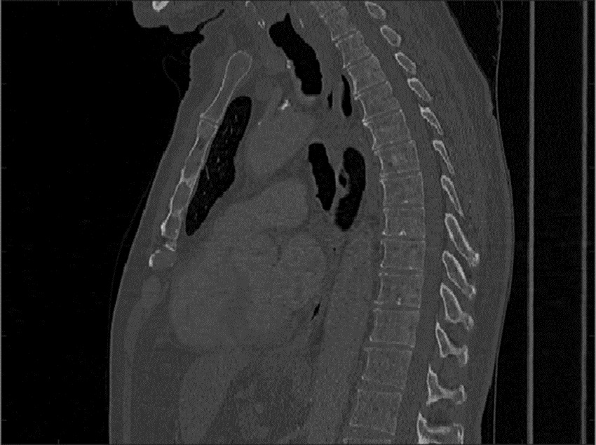 | 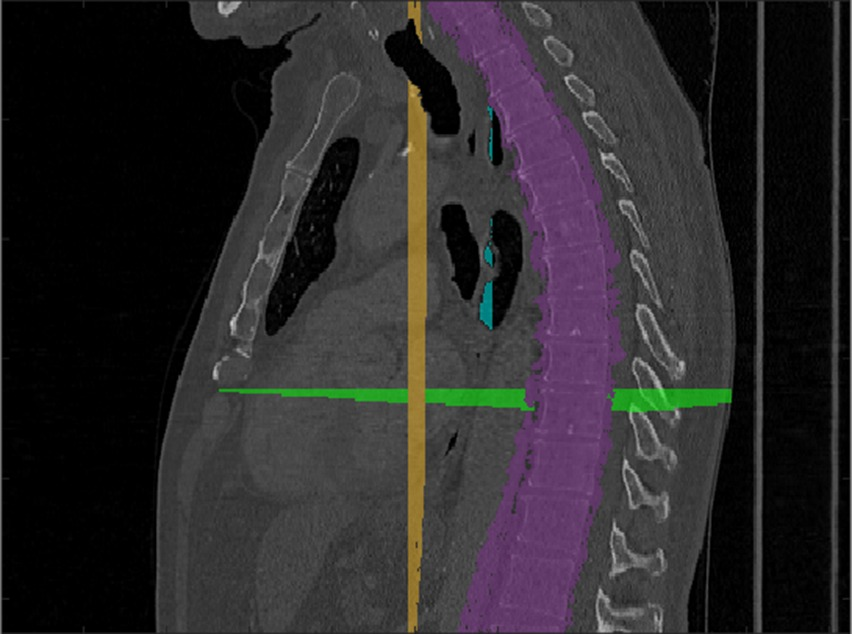 |

### 3D CT Volume — Coronal Plane
| Original | Labeled (Heart) | Labeled (Lungs) |
|---|---|---|
| 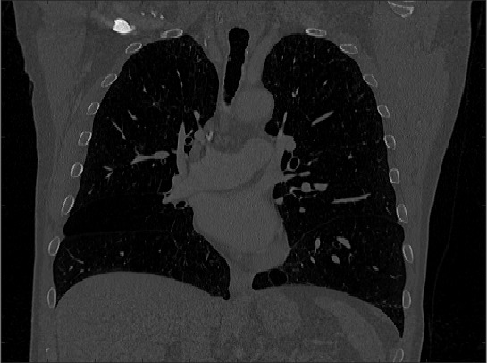 | 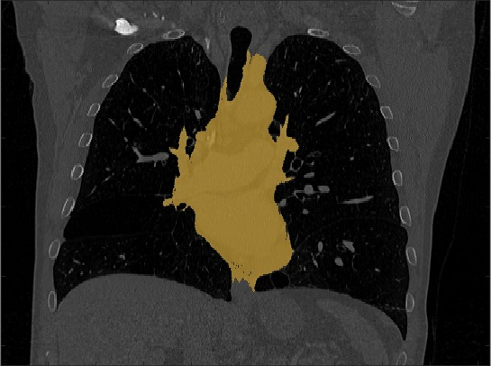 | 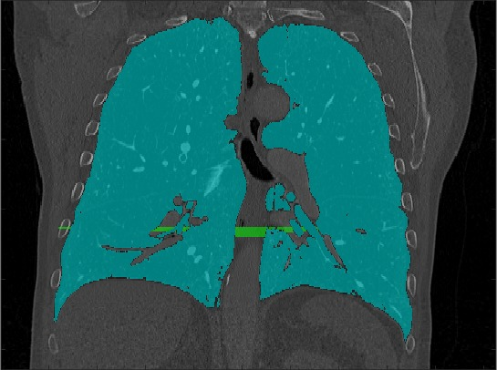 |

### 3D Volume Render
| Original | Labeled |
|---|---|
| 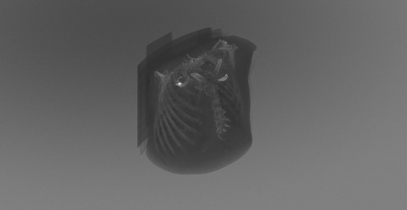 | 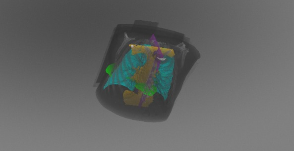 |

### Ultrasound — Human Heart (2D)
| Original | Labeled |
|---|---|
| 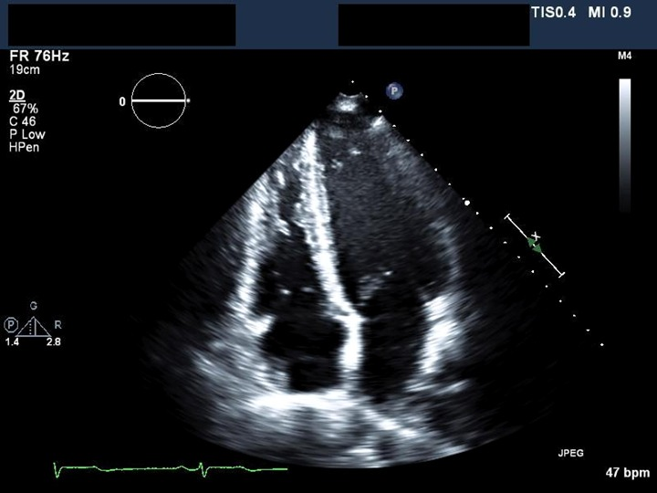 | 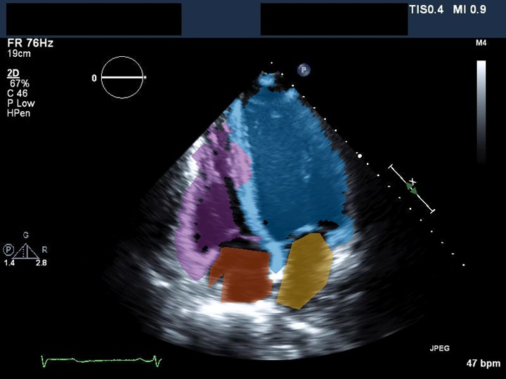 |

### CT Transverse Slice — Lungs
| Original | Labeled |
|---|---|
| 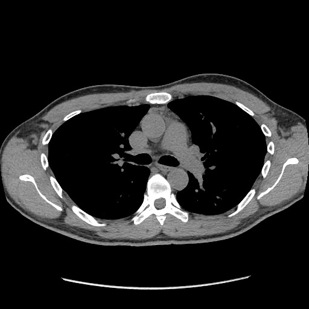 | 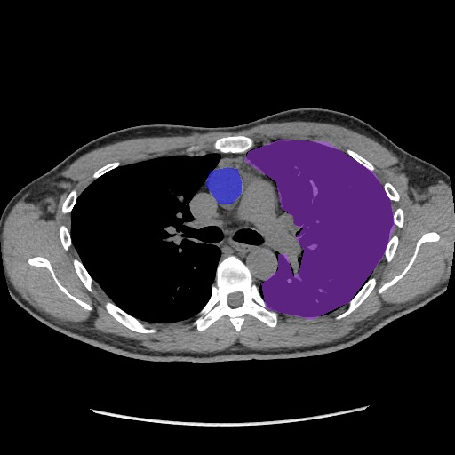 |

> Labels include: heart, lungs, vertebral column, cardiac ventricles, and tumors

## Repo Structure

```
matlab-medical-labeler/
├── scripts/
│   ├── load_and_visualize.m     # Load & display MRI slices (works in MATLAB Online)
│   ├── polygon_roi_label.m      # Draw polygon ROIs and export masks
│   └── export_gif.m             # Export animated GIF of volume slices
├── sample_output/               # Screenshots and GIFs from the original lab
└── README.md
```

---

## Skills Demonstrated

| Skill | Details |
|---|---|
| **Medical Image I/O** | Read DICOM series and NIfTI volumes |
| **Multi-planar Visualization** | Sagittal, coronal, and transverse slice display |
| **Interactive Annotation** | Polygon ROI + manual interpolation across 10+ frames per series |
| **3D Volume Segmentation** | Labeled heart, lungs, vertebral column across volumetric CT data |
| **Ground Truth Export** | Exported annotations as `groundTruthMedical` objects for ML pipelines |
| **GIF Animation** | Generated and exported animated slice-through visualizations |

---

## Running the Scripts (MATLAB Online)

All scripts use MATLAB's built-in `mri` dataset — no uploads needed.

**1. Visualize MRI slices**
```matlab
% Paste load_and_visualize.m into the editor and hit Run
% You'll get: multi-planar view, montage, and 3D isosurface
```

**2. Draw a Polygon ROI**
```matlab
% Paste polygon_roi_label.m and hit Run
% Draw your polygon on the image, double-click inside to confirm
% Mask saves automatically to MATLAB Drive
```

**3. Export a GIF**
```matlab
% Paste export_gif.m and hit Run
% brain_slices.gif saves to MATLAB Drive
% Download it from drive.matlab.com
```

---
## Background

Medical image labeling is a critical step in building AI-powered diagnostic tools. Labeled datasets (ground truth) are used to train deep learning segmentation models — such as U-Net — that can automatically identify anatomical structures in clinical scans. This project provided hands-on experience with the full annotation pipeline used in real medical AI workflows.

---
## Requirements

- [MATLAB Online](https://matlab.mathworks.com) (free account) — or MATLAB R2023a+
- Image Processing Toolbox

---

## References

- [MATLAB Medical Image Labeler Docs](https://www.mathworks.com/help/images/medical-image-labeler-app.html)
- Yang et al., "Classification of Medical Image Notes for Image Labeling by Using MinBERT," *Tsinghua Science and Technology*, 2023. [DOI](https://doi.org/10.26599/TST.2022.9010012)

